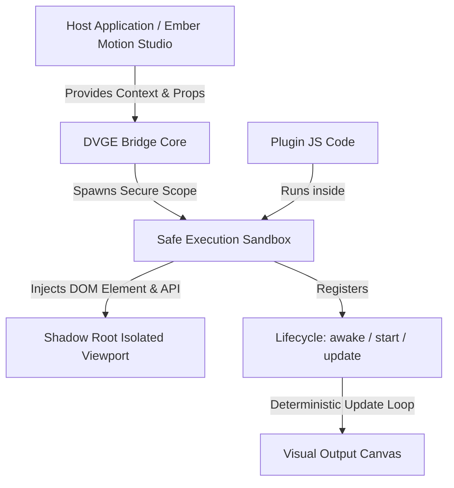

# 🌀 @dvge/core — Headless Dynamic Vector Graphics Engine

[](https://www.npmjs.com/package/@dvge/core)
[](LICENSE)
[]()
[]()

**@dvge/core** is a state-of-the-art, high-performance, headless dynamic vector graphics and animation engine. Built specifically for modern design tools, video editors (like Remotion), and real-time broadcast graphic packages, it provides a 100% frame-accurate, mathematically deterministic animation runtime in a secure sandboxed environment.

---

## 🌟 Core Features

- **⏱️ Frame-Accurate Determinism**: Purely algebraic timeline calculations. Zero dependencies on system time, `requestAnimationFrame`, `setTimeout`, or `setInterval`. The rendering state depends strictly on the current `frame` index.
- **🛡️ Secure Shadow DOM Sandboxing**: Runs user-generated scripts in a safe context, isolating global variables while executing cleanly inside an independent Shadow Root to prevent style leakage and namespace pollution.
- **⚡ High-Performance Easing & Spring Math**: Integrated mathematical functions including cubic beziers, custom spring physics (stiffness, damping), and typewriter effects designed for smooth vector calculations.
- **📱 Responsive Layout Engines**: Native coordinate remapping utilities (`remapX`, `remapY`) designed to translate canvas dimensions dynamically for landscape or portrait viewports.
- **🎨 Dynamic Component Schemas**: Fully structured form fields for rendering properties dynamically on host inspector panels.

---

## 📦 Installation

To add the dynamic vector engine to your project:

```bash
# Using pnpm
pnpm add @dvge/core

# Using npm
npm install @dvge/core

# Using yarn
yarn add @dvge/core
```

---

## 🛠️ Public API Reference

The core package exposes a minimalist, high-fidelity set of utilities and execution mechanisms:

```typescript
import {
  dvUtils,
  executePluginSandbox,
  calculateTimeline
} from '@dvge/core';
```

### 1. `executePluginSandbox`

Creates a sandboxed scope to compile and execute a plugin's JavaScript code.

```typescript
executePluginSandbox(
  jsCode: string,
  context: DVContext,
  onRegister: (lifecycle: DVLifecycle) => void
): void
```

> [!NOTE]
> Under the hood, the sandbox intercepts standard web APIs (`window`, `globalThis`, `require`) to ensure the script does not pollute the host application and registers standard lifecycle callbacks like `awake`, `start`, and `update`.

### 2. `calculateTimeline`

Computes deterministic timeline states for a given frame index.

```typescript
calculateTimeline(
  frame: number,
  fps: number,
  duration: number
): DVTimeline
```

Returns:
- `progress` (`number` from `0` to `1`): Normalized total animation timeline.
- `isIntro` (`boolean`): Active during the first 0.8 seconds.
- `isOutro` (`boolean`): Active during the last 0.5 seconds.
- `introProgress` (`number`): `0` to `1` progress during the intro phase.
- `outroProgress` (`number`): `0` to `1` progress during the outro phase.

### 3. `dvUtils` (Native Math & Animation Utilities)

A collection of fast, dependency-free mathematical utilities tailored for vector graphics:

| Utility Function | Parameters | Description |
|---|---|---|
| `lerp` | `(a: number, b: number, t: number)` | Linear interpolation. |
| `bezier` | `(curveParams: string \| number[], t: number)` | Calculates cubic bezier curve position. |
| `clamp` | `(val: number, min: number, max: number)` | Clamps a value within limits. |
| `spring` | `(t: number, stiffness?, damping?)` | Elastic spring animation (damping ratio). |
| `mapRange` | `(val, inMin, inMax, outMin, outMax)` | Re-maps a number from one range to another. |
| `typewriter` | `(text, frame, framesPerChar?)` | Substrings a text based on current frame. |
| `tickerOffset` | `(frame, speed, textWidth)` | Calculates seamless text ticker offset. |
| `loop` | `(frame, duration)` | Normalized loop progression. |
| `remapX` | `(x, designWidth?, currentWidth)` | Rescales horizontal positions responsively. |
| `remapY` | `(y, designHeight?, currentHeight)` | Rescales vertical positions responsively. |

---

## 🚀 Quick Start Example

Here is how you can mount a DVGE plugin dynamically using modern JavaScript/TypeScript in a React, Svelte, or Vanilla component:

```typescript
import { executePluginSandbox, dvUtils, calculateTimeline } from '@dvge/core';

// 1. Prepare your container and Shadow Root
const container = document.getElementById('canvas-container');
const shadowRoot = container.attachShadow({ mode: 'open' });

// 2. Prepare the execution context for a specific frame
const frame = 45; // 45th frame (1.5 seconds at 30fps)
const fps = 30;
const duration = 150; // 5 seconds long

const context = {
  root: shadowRoot,
  frame: frame,
  props: {
    titleText: "Dynamic Graphics Engine",
    primaryColor: "#E44C30",
    slideDistance: 250
  },
  utils: dvUtils,
  timeline: calculateTimeline(frame, fps, duration),
  state: {}, // Persistent state across frames
  refs: {},  // Persistent HTML Element references
  env: {
    isExporting: false,
    resolution: { width: 1920, height: 1080 },
    aspectRatio: 16 / 9,
    isPortrait: false
  },
  global: {} // App-wide shared variables
};

// 3. Define the plugin code (typically loaded from a database or file)
const pluginJS = `
  window.update = (frame, props, ctx) => {
    let titleEl = ctx.root.getElementById('title');
    if (!titleEl) {
      titleEl = document.createElement('div');
      titleEl.id = 'title';
      titleEl.style.position = 'absolute';
      titleEl.style.fontSize = '80px';
      titleEl.style.fontFamily = 'Outfit, sans-serif';
      titleEl.style.color = props.primaryColor;
      ctx.root.appendChild(titleEl);
    }
    
    // Smooth deterministic spring entry
    const entryProgress = ctx.utils.spring(ctx.timeline.introProgress, 200, 20);
    const xPos = ctx.utils.lerp(-props.slideDistance, 100, entryProgress);
    
    titleEl.textContent = ctx.utils.typewriter(props.titleText, frame, 3);
    titleEl.style.transform = \`translateX(\${xPos}px)\`;
  };
`;

// 4. Run inside the safe sandbox
executePluginSandbox(pluginJS, context, (lifecycle) => {
  if (lifecycle.awake) lifecycle.awake(context);
  if (lifecycle.start) lifecycle.start(context);
  if (lifecycle.update) lifecycle.update(context);
});
```

---

## 🎨 Architecture Overview



---

## 🧪 Quality and Testing

The core includes rigorous mathematical tests using [Vitest](https://vitest.dev/) to guarantee pixel-perfect deterministic consistency:

```bash
# Run unit and Property-Based Tests (PBT)
pnpm test
```

---

## 📜 License

MIT License — see the [LICENSE](LICENSE) file for details.

© 2026 Jonatan Baron. All rights reserved.
